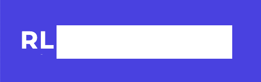
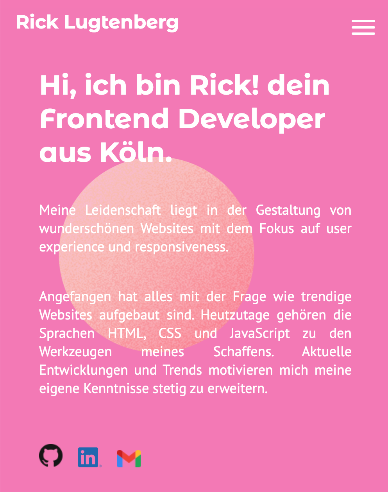

# Portfolio Project

This website shows my work and the abilities to work with animations. 

## Technologies

* HTML, Sass and JavaScript
* GSAP
* Parcel

## Features

* Display projects
* Animations
* Contact form 

## Approach

The site opens with a splash screen which discovers my name. For this animation **GSAP Timeline** was used, because this tool makes it easy to set the starting time of all the different parts of the animation. The hamburger menu in the mobile version is also created with GSAP Timeline.

The logo has an hover effect. This function is made with **requestAnimationFrame and CSS keyframes**. requestAnimationFrame is a function on the window property. There are two function defined. Mouseover and mouseout. In the mouse out function start with cancelAnimationFrame for the case that the mouse out start before the end of the animation.

The color of the nav bar changes in the project section. The background color in this section is white, for readability the color of the nav bar is therefor turned into black. The marker of the when the color should be changed are set on rendering with **GSAP ScrollTriger**. Every time the project details are set out, she markers are set new. 

Also set with GSAP ScrollTrigger is the sun, which can be found in the about section. The sun is animated along a path with the **MotionPathPlugin**. Together with GSAP ScrollTrigger MotionPathPlugin is a powerful tool that allows you to set the progression of an animation equal to the distance you’ve scrolled. 

FormSubmit.co is used for the **backend of the contact form**. On submit the form is send to my email address. 
